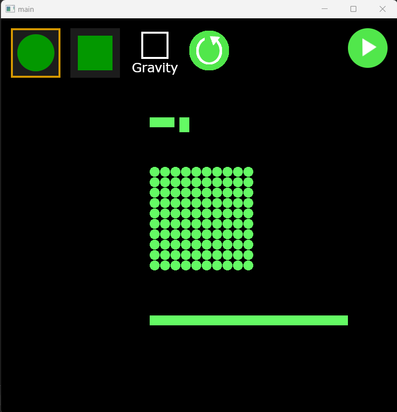
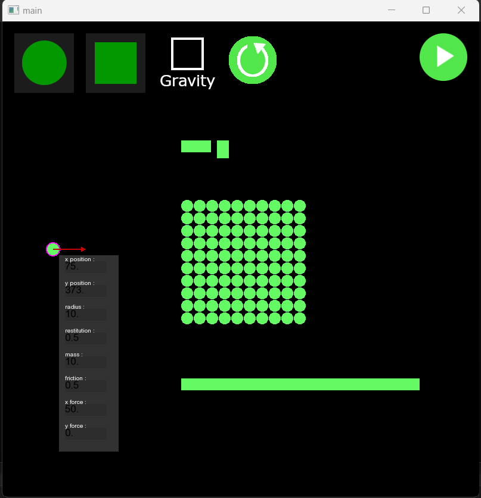
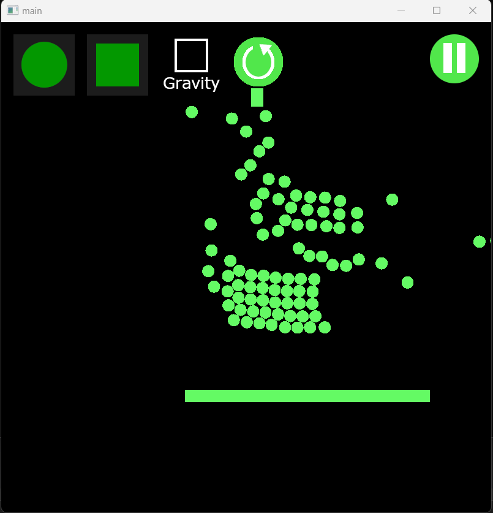

# 2D Physics Engine in C++ (2023)


⚠️ This project is not finished yet ⚠️

2D Physics Engine is a C++ project that allows simulating the physics of rectangular or circular objects in a 2D environment. The entire project is coded from scratch, providing a simulation of objects' motion and interaction based on physical principles.

## Features

- **User Interface:** Launching the application presents a user interface where you can add objects to the scene (rectangle or circle).
- **Object Properties:** Customize object properties such as size, position, elasticity, mass, initial force, etc., using text boxes and UI elements.
- **Simulation Control:** Start and pause the simulation using a play button. You can enable or disable gravity during the simulation.
- **Interactive Pause:** When the simulation is paused, you can view the velocities of different objects and interactively modify their properties.
- **Clear Scene:** Clear the entire scene with a single button.
- **SFML Graphics:** The project utilizes SFML for the graphical interface, and all buttons and UI elements are coded from scratch without additional libraries.

## Project Structure

The project follows the structure below:

- `src/`: Contains the .cpp files, including `2D-Physics-Engine.cpp`, `button.cpp`, `functions.cpp`, `physics.cpp`, `scene.cpp`, and `struct.cpp`.
- `include/`: Holds associated .h files for each .cpp file (excluding 2D-Physics-Engine).
- `resources/sprites/`: Stores sprites for the UI.
- `resources/fonts/`: Contains fonts for the UI.

## Building the Project

To build the project, use CMake and follow these steps :

1. **Clone the Repository :**

```bash
git clone https://github.com/Atafid/2D-Physics-Engine.git
```

2. **Navigate to the Project Directory :**

```bash
cd 2D-Physics-Engine
```

3. **Create a Build Directory :**

```bash
mkdir build
cd build
```

4. **Run CMake :**

```bash
cmake ..
```

5. **Build the Project :**

```bash
cmake --build .
```

6. **Copy dlls and resources :**

```bash
cp _deps/sfml-build/lib/Debug/sfml-window-d-2.dll Debug/
cp _deps/sfml-build/lib/Debug/sfml-graphics-d-2.dll Debug/
cp _deps/sfml-build/lib/Debug/sfml-system-d-2.dll Debug/
cp -r resources/ Debug/
```

7. **Run the Executable :**

```bash
./Debug/2D-Physics-Engine
```

## Usage

### Adding Objects

- Click on the corresponding buttons at the top of the screen to add rectangular or circular objects to the scene.

### Modifying Objects

- To modify an object, click on it. If its contour turns violet, it means you can make changes.
  - Right-click somewhere on the screen to apply an initial force in the indicated direction, represented by a red arrow (with a maximum norm).
  - If there's a blue arrow on the object, it represents its current velocity in the paused simulation.
  - Modify other properties by entering values in the displayed textboxes when an object is selected.

### Changing Object Position

- Change the position of an object using drag-and-drop. Hold the left mouse button on the object and move it to the desired location.

### Scene Control

- **Clear Scene:** Use the "Clear Scene" button to remove all objects from the scene.
- **Toggle Gravity:** Enable or disable gravity in the simulation using the gravity toggle button.
- **Start/Pause Simulation:** Use the play button to start or pause the simulation.

## Screenshots

<p align="center">
	
</p>

<p align="center">
	
</p>

<p align="center">
	
</p>

You can also see a simulation running in `resources/img/demo.mp4`.

## TO DO

- Implement object rotations in the simulation.
- Allow adding irregular polygons to the simulation.

## Credits

- Project developed by Guillaume DI FATTA
